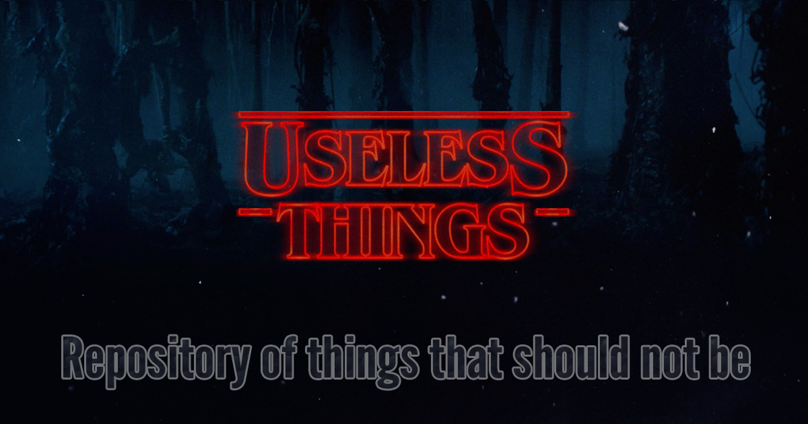

# Storage space of things that should not be

## Comes With:
* [\<Blink\>](#blink-tag)
* [\<SinWave\>](#sinwave)

### Blink Tag
Nostalgic for the 90s? Wish you could still have you own Geocities page? Well...
You can't...
But you can recreate some of that magic and annoyance with the Blink tag!
```js
import { Blink } from 'useless-things'
import { View, Image } from 'react-native'
...
  <Blink>Hey look at me blinking!</Blink>
...
  <Blink style={{ backgroundColor: 'red' }} duration={300}>
    <View />
  </Blink>
...
  <Blink>
    <Image
      style={{width: 200, aspectRatio: 1}}
      source={{uri: 'https://static.pexels.com/photos/54632/cat-animal-eyes-grey-54632.jpeg'}}
    />
  </Blink>
```
Blink props include the following:
* duration `number (400)`: Milliseconds between each blink
* style `Object ({width: 200, height: 100})`: Style of the blink container

### SinWave
How often have you thought, 'Wow, this app needs dots that move"?  Well now you can quickly and easily add sinusoidal dots to any application with ease.

```js
import { SinWave } from 'useless-things'
...
  <SinWave />
...
  <SinWave
    flat
    fade
    dotCount={50}
    delayGap={200}
    period={3000}
    style={{backgroundColor: '#feffff'}}
  />
```
SinWave props include the following:
* flat `boolean (false)`: Changes dots to lines
* fade `boolean (false)`: Changes opacity of dots in gradiation from 0 to 1
* dotCount `number (5)`: Number of dots in your sinwave
* delayGap `number (400)`: Milliseconds between each animation start
* period `number (2000)`: Milliseconds for one single oscillation
* style `StyleSheet ({})`: Additional styles

## Incoming:
* marquee tag
* terrible name generator
* tiled background
* konami code event
`... and so much more`


## To Run Example
```sh
$ cd examples
$ yarn
$ yarn ios
```
