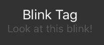
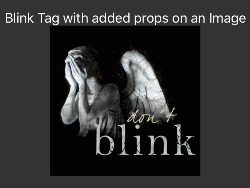
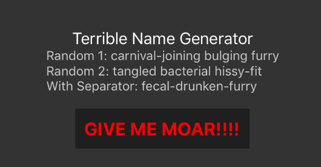
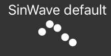
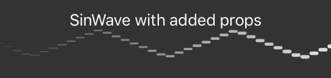
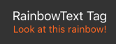
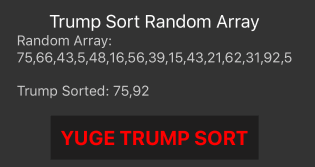

## Comes With:
* [\<Blink\>](#blink-tag) - Yes this classic HTML tag has a comeback tour, & it starts here.
* [TerribleName()](#terrible-names) - Need to name that uploaded file?  How about `carnival-joining-perverted-grapes.png`?
* [\<SinWave\>](#sinwave) - It's not math... it's useless!
* [\<RainbowText\>](#rainbowtext) - 🌈 🦄 🎉 ✍️
* [TrumpSort()](#trump-sort) - Make sorting great again

### Blink Tag
Nostalgic for the 90s? Wish you could still have you own Geocities page? Well...
you can't... but you can recreate some of that magic and annoyance with the Blink tag!
```js
import { Blink } from 'useless-things'
import { View, Image } from 'react-native'

...

  <Blink>Hey look at me blinking!</Blink>

```


But better than the [old blink tag](http://www.montulli.org/theoriginofthe%3Cblink%3Etag)!  You can blink anything!
```js
  <Blink duration={1000}>
    <Image
      style={{width: 200, aspectRatio: 1}}
      source={{uri: 'http://i.imgur.com/HLQp7FV.png'}}
    />
  </Blink>
```

**Blink props:**

|   Prop   |  Type  |            Default            |           Description           |
| ---------| ------ | ----------------------------- | ------------------------------- |
| duration | number | `(400)`                       | Milliseconds between each blink |
| style    | Object | `({width: 200, height: 100})` | Style of the blink container    |

### Terrible Names
Generate friendly names like `haunted effervescent twerk` for your app!  Use it for usernames, rooms, or whenever you need to assault your users with a moniker!

You can also just loop the output for some super classy _Lorem Ipsum_.

With a friendly `TerribleName` function, your customer service satisfaction can be unleashed!

```js
import { TerribleName } from 'useless-things'

const basic = TerribleName()
// result: pulsing confused fetish

const newDelimiter = TerribleName('-')
// result: acrid-haunted-furry
```


> 🚨 **Pull Request Alert:** Only the most versatile yet terrible adjectives/nouns will be accepted.

This function takes one parameter; the delimiter for the resulting words.  Default value is a space.

### SinWave
You say it at least once per project,
> _"This app needs dots that move n stuff"?_

Well now you can quickly and easily add sinusoidal dots to any application with ease.

Basic usage:
```js
import { SinWave } from 'useless-things'

...

  <SinWave />
```


Advanced properties
```js
  <SinWave
    flat
    fade
    dotCount={50}
    delayGap={200}
    period={3000}
    style={{backgroundColor: '#feffff'}}
  />
```


**SinWave props:**

|    Prop    |    Type    | Default |                    Description                    |
| ---------- | ---------- | ------- | ------------------------------------------------- |
| `flat`     | boolean    | `false` | Changes dots to lines                             |
| `fade`     | boolean    | `false` | Changes opacity of dots in gradiation from 0 to 1 |
| `dotCount` | number     | `5`     | Number of dots in your sinwave                    |
| `delayGap` | number     | `400`   | Milliseconds between each animation start         |
| `period`   | number     | `2000`  | Milliseconds for one single oscillation           |
| `style`    | StyleSheet | `null`  | Additional styles                                 |

### RainbowText
Your client tells you all the time,
> _"Doesn't it lack a little bit of color"?_

He wants color, give him color!

Basic usage:
```js
import { RainbowText } from 'useless-things'

...

  <RainbowText>Look at this rainbow!</RainbowText>
```


**RainbowText props:**

|    Prop    |    Type    | Default |                    Description                    |
| ---------- | ---------- | ------- | ------------------------------------------------- |
| `style`    | StyleSheet | `null`  | Additional Text styles (color WILL be overwritten)|

### Trump Sort
I know we're all wondering where all these foreign numbers are coming from.  How are we supposed to keep these arrays sorted?

We've implemented a number form of [Trump Sort (more info here)](https://medium.com/@gantlaborde/trump-sort-a-new-sorting-algorithm-b37b1133356a), so you can rest your cheeto colored little hands.

```js
import { TrumpSort } from 'useless-things'

const classism = TrumpSort([2,2,3,5,1,2,7,9,5,8])
// result: [2, 2, 3, 5, 7, 9]
```


Check out that awesome wall we built to keep those numbers out!

## Incoming Features:
* beveled buttons
* marquee tag
* tiled background
* konami code event

[`... and so much more`](https://github.com/GantMan/useless-things/issues?q=is%3Aissue+is%3Aopen+label%3Aenhancement)


## To Run Example
```sh
$ cd example
$ yarn
$ yarn ios
```
